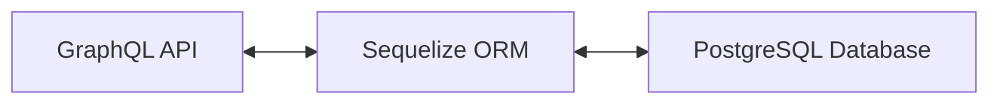

# Project work documentation (TTC8430-3005)

#### NHL Matches API

**4.12.2024**


---

### Plan

##### Project Group:

- I will work alone

##### Subject:

- Create an API service for tracking statistics from (imaginary) regular season NHL games

##### Framework:

- GraphQL with Typescript

##### Storage:

- PostgreSQL hosted on Render

##### Other libraries

- Zod
- Sequelize
- Lodash
- ESLint
- Prettier

##### Special features:

- Matches are added manually by providing required data
- User can query for different statistics, including: goals, assists, penalties
- Detailed match view, featuring goals, assists, penalties etc.

##### Schedule:

- Nothing set in stone, I try to work on this daily, at least for a bit

##### Architecture



---

### Features

#### Adding a match event


- New match is added if the given data is valid, otherwise a corresponding error message is displayed
- In case no team is found with given shorthand, a corresponding error message is displayed

##### Example match data object

```
  "input": {
    "awayTeam": "Boston Bruins",
    "awayTeamScore": 4,
    "date": "2024-12-03T19:30:00",
    "goals": [
      {
        "assist": ["David Pastrnak", "Brad Marchand"],
        "period": 1,
        "powerPlay": false,
        "scorer": "Charlie McAvoy",
        "shortHanded": false,
        "timestamp": "2024-12-03T19:45:00"
      }
    ],
    "homeTeam": "Toronto Maple Leafs",
    "homeTeamScore": 3,
    "location": "Scotiabank Arena",
    "penalties": [
      {
        "additionalMinutes": null,
        "minutes": 2,
        "penalizedPlayer": "Auston Matthews",
        "period": 1,
        "timestamp": "2024-12-03T19:50:00",
        "type": "Tripping"
      },
    ],
    "referees": ["Gord Dwyer", "Frederick L'Ecuyer"]
  },
```

---

#### Query for match events

##### Get match by ID


- All saved matches can also be queried for at once

---

#### Query for player statistics

##### Example query for most goals, assists and penalty minutes


---

#### String search query

##### Query targets home team, away team or location


---

### Self-Assessment

**Grade Proposition**: 4,5/5-

- I am very much on the fence with the grade proposition
- I Spent a little bit over 40 hours working on this
- Apart from some SQL Model and GraphQL boilerplate, everything is self-made
- Most valuable achievement is terms of features is the query for the leading player in terms of points

##### Pros

- It works as intended
- Documentation
- Input is validated using Zod
- App is hosted in Cloud
- It uses a relevant and sensible choice of libraries and frameworks
- TypeScript to implement basic code level documentation and better IntelliSense, also reduces runtime bugs
- Code is divided into multiple files
- ESLint and Prettier for static analysis and enforcing standard coding practices
- GraphQL automatically documents API calls

##### Cons

- It has no user management or authorization
- Perhaps it would've been better to divide goals, penalties, teams, players etc. into their own models and use foreign keys to fetch the data, but that would've meant a lot of work
- A large dataset of hundreds of matches can cause some problems with the filtering and sorting logics
- Players are in no way associated with their teams
